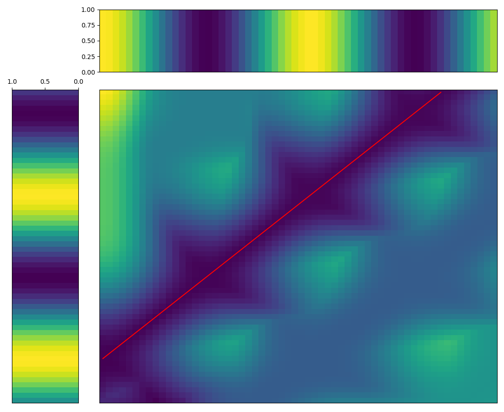
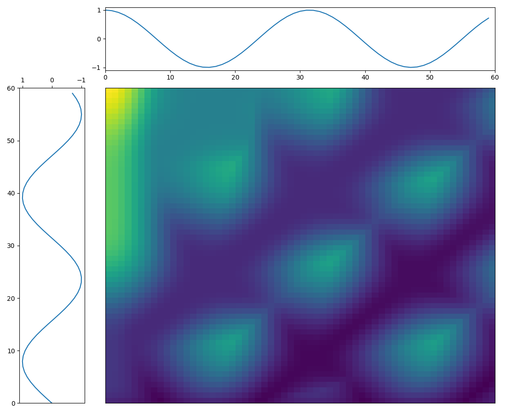

# Dtw module

## Description

Basic Dynamic Time Warping functions with optional C library functions for speed. The main difference between this module and similar implementations is that it is fairly low level (a lot of the code has to be written by the user) and implements SPRING-DTW with real-time applications in mind.

## Usage

```python
import numpy as np
from ctypes import c_int

import dtw_live.viz as viz
from dtw_live.dtw import cost_matrix, warp_path
from dtw_live.dtw_c import update_dist_c

rng = np.arange(0, 12, 0.2)
s1 = np.sin(rng)[:, np.newaxis]
s2 = np.cos(rng)[:, np.newaxis]
psi = 0.2
```

Calculate the DTW cost matrix for s1 and s2:

```python

m_dtw = cost_matrix(s1, s2, psi=psi, use_c=True)

# calculate the warping path for m_dtw
path_dtw = warp_path(m_dtw, psi=psi)

# plot results
viz.cost_matrix(m_dtw, path=path_dtw, s1=s1, s2=s2, plot_mesh=True)
viz.show()
```



Calculating the SPRING-DTW cost matrix for s1 applied to s2 (cost set to 0 for each timeframe in s2):

```python

n1 = s1.shape[0]
n2 = s2.shape[0]
d = s1.shape[1]

dist_spring = np.full(n2, np.inf)
m_spring = np.full((n1,n2), np.inf)

for i, frame in enumerate(s2):
    # store current costs in dist_spring array
    update_dist_c(frame, s1, n1, n_features, dist_spring)

    # fill cost matrix
    m_spring[:, i] = np.sqrt(dist_spring)

# plot results
viz.cost_matrix(m_spring, s1=s1, s2=s2)
viz.show()
```


